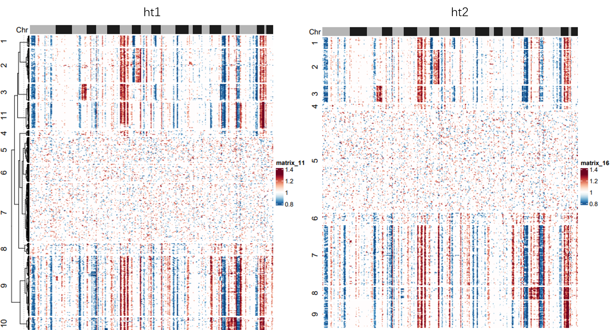
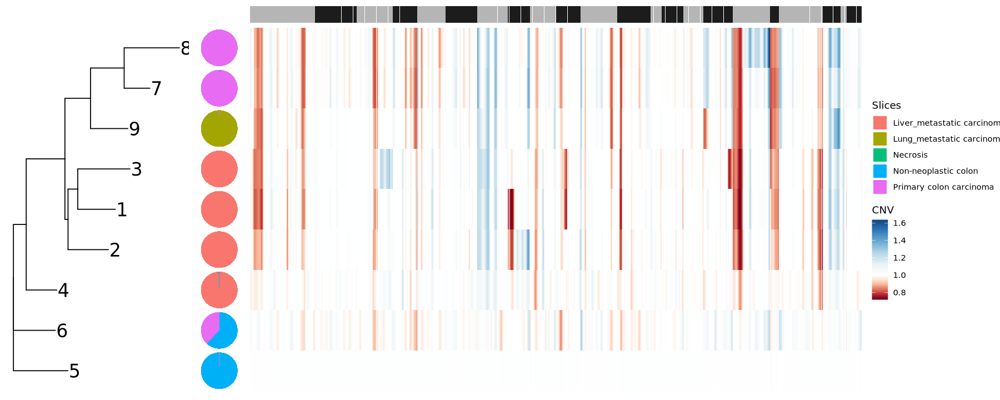

# Phylogenic analysis to study tumor evolution from omics data  
## Phylogenic analysis from multi-regional analysis from WGS/WES data
Sample data are aquired from __Quantitative evidence for early metastatic seeding in colorectal cancer__ (Supplementary Table 8) and __Mapping the spreading routes of lymphatic metastases in human colorectal cancer__ ().  
### Heterogeneity measure between samples


### Phylogenetic reconstruction


### Metastatic dissemination pattern dissection


## Phylogenic analysis from scRNA-Seq/ST
Sample data are aquired from __Spatial multi-omics landscape of colorectal cancer macro- and micrometastases__ (PAT1 in Figure 2). Processed data acquired from GSE294385 (M-ST-13: CRC, M-ST-05: CLiM, M-ST-14: CLuM). Spot annotation could be found in https://github.com/yliuup/CRC_micromets_ST/blob/main/Meta_data/visium_meta_raw.rds.  
### Phylogenetic reconstruction from somatic mutation


### Phylogenetic reconstruction from CNV
Infer CNV profile using scRNA-Seq or ST data:  
``` R
library(dplyr)
library(Seurat)
library(infercnv)

# select cells or spots that belong to benign or malignant tissue
selected_cluster=c('Liver macrometastasis tumor','Liver micrometastasis tumor',
  'Lung macrometastasis tumor',
  'Non-neoplastic colon',
  'Tumor cells in mucosa and submucosa','Tumor cells at tumor invasive front/border','Tumor cells in muscularis propria','Tumor cells in muscularis propria')
seurat_obj=subset(seurat_obj,subset= ( Layer3 %in% selected_cluster ))

# run infercnv 
raw_count_mat=as.matrix(seurat_obj@assays[["RNA"]]@counts)
gene_ordering_table=read.table('./gene_ordering_file.txt',
                                  header=FALSE,sep=" ",check.names=FALSE) %>%
   .[! duplicated(.[,1],fromLast=TRUE,),] %>%
   data.frame(row.names=1,check.names=FALSE)
cell_type_annotation=seurat_obj@meta.data['Layer3']

infercnv_obj=infercnv::CreateInfercnvObject(raw_counts_matrix=raw_count_mat,
                                            annotations_file=cell_type_annotation, 
                                            gene_order_file=gene_ordering_table, 
                                            ref_group_names=c('Non-neoplastic colon'), 
                                            chr_exclude=c("chrX","chrY","chrM","KI270734.1"))
infercnv_obj=infercnv::run(infercnv_obj,
                           cutoff=0.1, 
                           out_dir='./infercnv_with_reference',
                           num_threads=15,
                           cluster_by_groups=FALSE,
                           denoise=TRUE,
                           HMM=FALSE)
```
Based on the CNV profiles, identify phylogenetic clones:  
``` r
# cells/spots clustering based on the CNv profiles
source('https://github.com/KaWingLee9/in_house_tools/blob/main/visulization/custom_fun.R')

# infercnv_obj=readRDS('run.final.infercnv_obj')
cnv_mat=t(infercnv_obj@expr.data)
gene_order=infercnv_obj@gene_order[,'chr']
col_chr=rep(c('#B5B5B5','#1C1C1C'),11)
names(col_chr)=1:22
heatmap_cutoff=0.01
col_cnv=circlize::colorRamp2(unique(c(seq(quantile(unlist(cnv_mat),heatmap_cutoff),1,length.out=6),
                                    1,
                                    seq(1,quantile(unlist(cnv_mat),1-heatmap_cutoff),length.out=6))),
                             c('#104680','#317CB7','#6DADD1','#B6D7E8','#E9F1F4','white',
                               '#FBE3D5','#F6B293','#DC6D57','#B72230','#6D011F'))

# visualization of the tumor cells or spots, based on which determined the number of clusters
ht1=Heatmap(cnv_mat,clustering_method_rows='ward.D2',
           show_row_names=FALSE,show_column_names=FALSE,# row_split=cl[rownames(cnv_mat)],
           # cluster_rows=cluster_within_group(cnv_mat,cl),
           row_dend_reorder=TRUE,clustering_distance_rows='eudclidean',
           col=col_cnv,
           top_annotation=HeatmapAnnotation(Chr=as.numeric(gene_order),
                                               col=list(Chr=col_chr),show_legend=FALSE,annotation_name_side='left'),
           cluster_columns=FALSE)

# automatically identify clones by clustering using hclust with Euclidean's distance and ward.D2, and determine the number of clusters
cl=SimilarityClustering(cnv_mat,mode='manual',select.cutoff=FALSE,
                        similarity.method='pearson',hc.method='ward.D2',cluster_num=11)

# combine clusters with similar CNV profiles -> tumor clones
cl1=ClusterCombine(cl,c(5,6,7),reorder=TRUE)
ht2=Heatmap(cnv_mat,col=col_cnv,
           show_row_names=FALSE,show_column_names=FALSE,row_split=cl1[rownames(cnv_mat)],
           # cluster_rows=cluster_within_group(cnv_mat,cl),
           cluster_rows=FALSE,
           clustering_method_rows='ward.D2',clustering_distance_rows='pearson',
           top_annotation=HeatmapAnnotation(Chr=as.numeric(gene_order),
                                               col=list(Chr=col_chr),show_legend=FALSE,annotation_name_side='left'),
           cluster_columns=FALSE)
```
<p align="center">
  
</p>

and construct phylogentic tree:  
```r
cnv_mat=cnv_mat %>% data.frame(check.names=FALSE)
cnv_mat[,'cl1']=cl1[rownames(cnv_mat)] %>% as.character()
cnv_mat_mean=cnv_mat %>% group_by(cl1) %>% summarise_if(is.numeric,mean) %>% data.frame(row.names=1,check.names=FALSE)

# build phylogenetic tree using NJ method
d=dist(cnv_mat_mean)
nj_tree=ape::nj(d)
rooted_tree=ape::root(nj_tree,outgroup='5',resolve.root=TRUE)
p1=ggtree(rooted_tree)+
    theme_tree()+
    # geom_tippoint(size=5)+
    geom_tiplab(hjust=0,color="black",size=7)+
    theme(legend.position="none")+
    theme(plot.margin=margin(0, 0, 0, 0))

# mean CNV profile
cnv_mat_mean_l=cnv_mat_mean %>% as.matrix() %>% reshape2::melt(varnames=c('cluster','gene'),value.name='CNV')
cnv_mat_mean_l[,'cluster']=as.character(cnv_mat_mean_l[,'cluster'])
p2=ggplot(cnv_mat_mean_l,aes(x=gene,y=cluster,fill=CNV))+
    geom_tile(color=NA)+
    theme_void()+
    scale_fill_gradientn(colors=c('#104680','#317CB7','#6DADD1','#B6D7E8','#E9F1F4','white','#FBE3D5','#F6B293','#DC6D57','#B72230','#6D011F'), 
                     values=scales::rescale( c( seq( max(cnv_mat_mean_l[,'CNV']) , 1, length.out=6  )[1:5], 1 , seq( 1, min(cnv_mat_mean_l[,'CNV']),  length.out=6  )[2:6] ) ) )+
    theme(plot.margin=margin(0, 0, 0, 0))
chr_df=data.frame(row.names=colnames(cnv_mat_mean),'chr'=gene_order)
p3=AnnotatedPlot(p2,df_anno_x=chr_df,top_anno_var='chr',anno_colors=list(chr=c( rep(c('#B5B5B5','#1C1C1C'),11) )),heights=0.05)
p3[[2]]=p3[[2]]+guides(fill='none')

# region composition of the tumor clones
anno_data[,'cluster']=cl1[rownames(anno_data)]
anno_data=na.omit(anno_data)
clone_comp=table(anno_data[,c('Layer2','cluster')]) %>% as.data.frame.array(check.names=FALSE) %>% apply(2,function(x) {x/sum(x)} ) %>% 
    t() %>% data.frame(check.names=FALSE)
clone_comp[,'cluster']=as.character(rownames(clone_comp))
clone_comp[,'x']=0
options(repr.plot.height=7,repr.plot.width=5)
p4=ggplot(data=clone_comp,aes(x=x,y=cluster))+
    PieGlyph::geom_pie_glyph(slices=colnames(clone_comp)[1:5],radius=0.7)+
    theme_void()
```
<p align="center">
  
</p>

__Reference__:  
[1] Erickson, A., He, M., Berglund, E., Marklund, M., Mirzazadeh, R., Schultz, N., Kvastad, L., Andersson, A., Bergenstråhle, L., Bergenstråhle, J., Larsson, L., Alonso Galicia, L., Shamikh, A., Basmaci, E., Díaz De Ståhl, T., Rajakumar, T., Doultsinos, D., Thrane, K., Ji, A. L., Khavari, P. A., … Lundeberg, J. (2022). Spatially resolved clonal copy number alterations in benign and malignant tissue. Nature, 608(7922), 360–367. https://doi.org/10.1038/s41586-022-05023-2
[2] Liu, Y., Jadhav, A. S., Pan, Y., Liao, J., Khanduri, I., Liu, Y., Katkhuda, R., Lu, W., Cho, K. S., Tong, Z., Zhou, T., Lin, K., Sun, B., Jiang, M., Hernandez, S. D., Lubo Julio, I. C., Brennan, P., Pei, G., Yu, K., Dai, Y., … Maru, D. (2026). Spatial multi-omics landscape of colorectal cancer macro- and micrometastases. Cancer cell, 44(8), 1568–1586.e11.  
[3] Pei, G., Min, J., Rajapakshe, K. I., Branchi, V., Liu, Y., Selvanesan, B. C., Thege, F., Sadeghian, D., Zhang, D., Cho, K. S., Chu, Y., Dai, E., Han, G., Li, M., Yee, C., Takahashi, K., Garg, B., Tiriac, H., Bernard, V., Semaan, A., … Maitra, A. (2025). Spatial mapping of transcriptomic plasticity in metastatic pancreatic cancer. Nature, 642(8066), 212–221.  
[4] Yu, K., Chen, J., Chu, Y. Y., Nair, S., Crupi, E., Hasanov, E., Mei, Y., Han, X., Liu, Y., Liu, Y., Pei, G., Peng, F., Liao, J., Dai, E., Chu, T., Cho, K. S., Jiang, J., Yan, X., Dai, Y., Wang, J., … Wang, L. (2026). A Spatial Atlas of Muscle-Invasive Bladder Cancer Reveals Lineage-Specific Vulnerabilities and Immune Architecture. Cancer discovery, 10.1158/2159-8290.CD-26-0099. https://doi.org/10.1158/2159-8290.CD-26-0099  

## Phylogenic analysis from scRNA-Seq/ST with paired WES/WGS  
### Mutation calling based on scRNA-Seq and paired WES  
scVarScan

### CNV inference based on scRNA-Seq and paired WES - IntegrateCNV


__Reference__: 

## Phylogenic analysis from scDNA-Seq
Sample data are aquired from .


