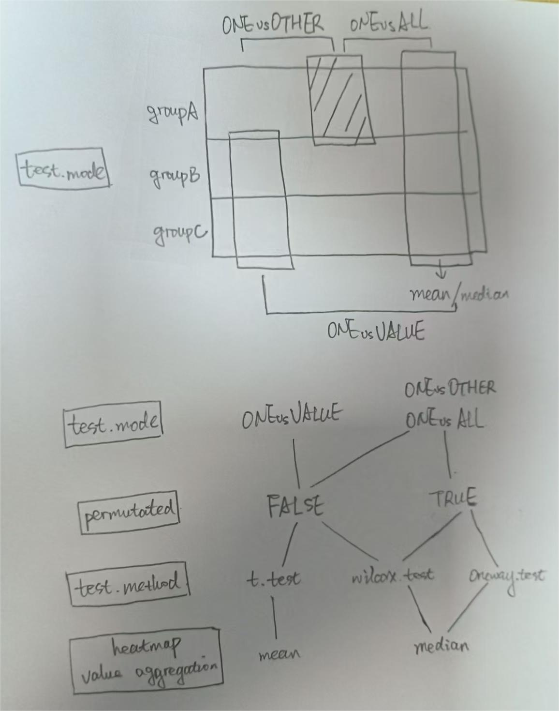

# Custom R visualization functions

## Table of Contents
* [CorPlot - Correlation bubble plot with significance test](#correlation)
* [SHeatmap - Summarized heatmap of group data with significance test](#heatmap1)

## <a name="correlation">CorPlot - Correlation bubble plot with significance test</a>
Required packages: Hmisc, dendsort  
``` r
library(ggplot2)
library(patchwork)
source('https://github.com/KaWingLee9/in_house_tools/blob/main/visulization/custom_fun.R')

# load dataset
data(mtcars)

p1=CorPlot(mtcars,cor.method='pearson',tri='whole',size='p.adj',p.adj.method='fdr',sig.level=0.01,sig.circle=TRUE)
p2=CorPlot(mtcars,cor.method='pearson',tri='upper',size='p.adj',p.adj.method='fdr',sig.level=0.01,sig.circle=FALSE)+expand_limits(x=c(0,12))
p3=CorPlot(mtcars,cor.method='pearson',tri='lower',size='p.value',sig.level=0.01,sig.circle=TRUE)+expand_limits(x=c(-1,11))

options(repr.plot.height=5,repr.plot.width=5*3)
p1+p2+p3
```
<p align="center">
  
</p>

Parameters of `CorPlot`:
+ `df`: data frame (observations x variables)
+ `cor.method`: methods to calculate correlation, could be `pearson` or `spearman`, passed on to `Hmisc::rcorr(type=...)`
+ `tri`: show the `whole` matrix or `upper`/`lower` triangular matrix
+ `size`: `p.value` or `p.adj` reflected by bubble size
+ `p.adj.method`: method for p value adjustment (e.g. `bonferroni` or `fdr`), passed on to `p.adjust(method=...)`
+ `sig.circle`: whether to show outlines of the bubbles if significant
+ `sig.level`: significance level for hypothesis test, reflected in sig.circle

## <a name="heatmap1">SHeatmap - Summarized heatmap of group data with significance test</a>
Required packages: dplyr, ComplexHeatmap  
``` r
# load dataset
data(iris)
head(iris)
  Sepal.Length Sepal.Width Petal.Length Petal.Width Species
1          5.1         3.5          1.4         0.2  setosa
2          4.9         3.0          1.4         0.2  setosa
3          4.7         3.2          1.3         0.2  setosa
4          4.6         3.1          1.5         0.2  setosa
5          5.0         3.6          1.4         0.2  setosa
6          5.4         3.9          1.7         0.4  setosa

# generate a long data frame as input data
df=reshape2::melt(iris,id.vars='Species',measure.vars=c('Sepal.Length','Sepal.Width','Petal.Length','Petal.Width'))
head(df)
  Species     variable value
1  setosa Sepal.Length   5.1
2  setosa Sepal.Length   4.9
3  setosa Sepal.Length   4.7
4  setosa Sepal.Length   4.6
5  setosa Sepal.Length   5.0
6  setosa Sepal.Length   5.4

ht_1=SumHeatmap(df,group.col='Species',variable.col='variable',value.col='value',test.mode='ONEvsVALUE',
                name='Raw\nmatrix',
                test.method='t.test',permutated=FALSE,
                sig.level=c(0.00001,0.01),sig.label=c('**','*'),p.adj=TRUE,scale=FALSE)

ht_2=SumHeatmap(df,group.col='Species',variable.col='variable',value.col='value',test.mode='ONEvsVALUE',
                name='Scaled\nmatrix',col=circlize::colorRamp2(c(-2,0,4),c('#1a318b','#ffffff','#9a133d')),
                test.method='t.test',permutated=FALSE,
                sig.level=c(0.00001,0.01),sig.label=c('**','*'),p.adj=TRUE,scale=TRUE)

options(repr.plot.height=5,repr.plot.width=5*2)
draw(ht_1+ht_2,auto_adjust=FALSE)
```
<p align="center">
  
</p>

Parameters of `SHeatmap`:
+ `df`: a long data frame 
+ `group.col`: column name represents sample group
+ `variable.col`: column name represents variable
+ `value.col`: column name represents values
+ `test.mode`: one of  `ONEvsVALUE`, `ONEvsOTHER` and `ONEvsALL`
+ `permutated`: whether to use permutation-based method
+ `test.method`: one of `t.test`, `wilcox.test` and `oneway.test`
+ `sig.level`, `sig.label`: significance level and corresponding labels, should be increasing ordered
+ `p.adj`, `p.adj.method`: whether to adjust p value and method for p value adjustment (passed on to `p.adjust(method=...)`)
+ `scale`: whether to scale data within each variable
+ `...`: other arguments passed on to `ComplexHeatmap::Heatmap`

<p align="center">
  
</p>
