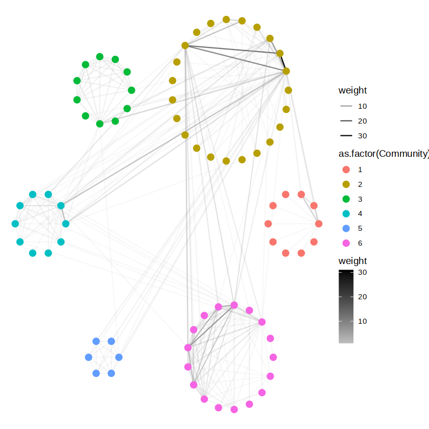

# Custom R visualization functions
First import the customized functions.
``` r
source('https://github.com/KaWingLee9/in_house_tools/blob/main/visulization/custom_fun.R')
```

## Table of Contents
+ [CorPlot - Correlation bubble plot with significance test](#correlation)
+ [ContigencyPlot](#contigencyPlot)
+ [ConditionHeatmap - Heatmap showing values under different condition](#conditionHeatmap)
+ [SHeatmap - Summarized heatmap of grouped data with significance test](#heatmap1)
+ [SimilarityClustering - Blocks division in similarity heatmap](#heatmap2)
+ [Other tips for clustering](#heatmap3)  
  Reorder row/column order of the table for heatmap visualization  
  Combine clusters
+ [LinkedPlot - Heatmap/Bubble plot with links](#link)
+ [OrderedPlot - Reset the order of x/y-axis or show dendrogram in ggplot2](#order)
+ [AnnotatedPlot - Draw annotation bar in ggplot2](#annotation)
+ [layout_circular_community - Network for each community as a circle (like cytoscape)](#circular)
+ [SunburstPlot - Sunburst plot](#sunburst)
+ [Forest plot for multiple types of regression model](#forest)
+ [Differential expression visualization](#deg)

## <a name="correlation">CorPlot - Correlation bubble plot with significance test</a>
__Required packages__: Hmisc, dendsort  
``` r
library(ggplot2)
library(patchwork)

# load dataset
data(mtcars)

p1=CorPlot(mtcars,cor.method='pearson',tri='whole',size='p.adj',p.adj.method='fdr',sig.level=0.01,sig.circle=TRUE)
p2=CorPlot(mtcars,cor.method='pearson',tri='upper',size='p.adj',p.adj.method='fdr',sig.level=0.01,sig.circle=FALSE)+expand_limits(x=c(0,12))
p3=CorPlot(mtcars,cor.method='pearson',tri='lower',size='p.value',sig.level=0.01,sig.circle=TRUE)+expand_limits(x=c(-1,11))

options(repr.plot.height=5,repr.plot.width=5*3)
p1+p2+p3
```
<p align="center">
  
</p>

Parameters of `CorPlot`:
+ `df`: data frame (observations x variables)
+ `cor.method`: methods to calculate correlation, could be `pearson` or `spearman`, passed on to `Hmisc::rcorr(type=...)`
+ `tri`: show the `whole` matrix or `upper`/`lower` triangular matrix
+ `size`: `p.value` or `p.adj` reflected by bubble size
+ `p.adj.method`: method for p value adjustment (e.g. `bonferroni` or `fdr`), passed on to `p.adjust(method=...)`
+ `sig.circle`: whether to show outlines of the bubbles if significant
+ `sig.level`: significance level for hypothesis test, reflected in sig.circle
+ `stroke`: outline thickness of the circle
+ `reorder.method`: method for reorder hierarchy, could be one of `reorder.dendrogram`, `dendsort`, `none`

## <a name="ContigencyPlot">ContigencyPlot</a>
__Required packages__: XXX  

## <a name="conditionHeatmap">ConditionHeatmap - Heatmap showing values under different condition</a>
__Required packages__: dplyr, ComplexHeatmap
``` r
library(gcookbook)
<p align="center">
  
</p>
options(repr.plot.height=4,repr.plot.width=4)
ConditionHeatmap(plum,x_col='length',y_col='time',group_col='survival',value_col='count',
                 row_gap=unit(0,'mm'),column_gap=unit(0,'mm'))
```

Parameters of `ConditionHeatmap`:
+ `df`: a long data frame 
+ `x_col`, `y_col`, `group_col`, `value_col`: column names of the x axis, y axis, condition to split heatmap and the value mapped to colors  
+ `...`: other arguments passed on to `ComplexHeatmap::Heatmap`  

## <a name="heatmap1">SHeatmap - Summarized heatmap of grouped data with significance test</a>
__Required packages__: dplyr, ComplexHeatmap  
``` r
# load dataset
data(iris)
head(iris)
  Sepal.Length Sepal.Width Petal.Length Petal.Width Species
1          5.1         3.5          1.4         0.2  setosa
2          4.9         3.0          1.4         0.2  setosa
3          4.7         3.2          1.3         0.2  setosa
4          4.6         3.1          1.5         0.2  setosa
5          5.0         3.6          1.4         0.2  setosa
6          5.4         3.9          1.7         0.4  setosa

# generate a long data frame as input data
df=reshape2::melt(iris,id.vars='Species',measure.vars=c('Sepal.Length','Sepal.Width','Petal.Length','Petal.Width'))
head(df)
  Species     variable value
1  setosa Sepal.Length   5.1
2  setosa Sepal.Length   4.9
3  setosa Sepal.Length   4.7
4  setosa Sepal.Length   4.6
5  setosa Sepal.Length   5.0
6  setosa Sepal.Length   5.4

ht_1=SumHeatmap(df,group.col='Species',variable.col='variable',value.col='value',test.mode='ONEvsVALUE',
                name='Raw\nmatrix',
                test.method='t.test',permutated=FALSE,
                sig.level=c(0.00001,0.01),sig.label=c('**','*'),p.adj=TRUE,scale=FALSE)

ht_2=SumHeatmap(df,group.col='Species',variable.col='variable',value.col='value',test.mode='ONEvsVALUE',
                name='Scaled\nmatrix',col=circlize::colorRamp2(c(-2,0,4),c('#1a318b','#ffffff','#9a133d')),
                test.method='t.test',permutated=FALSE,
                sig.level=c(0.00001,0.01),sig.label=c('**','*'),p.adj=TRUE,scale=TRUE)

options(repr.plot.height=5,repr.plot.width=5*2)
draw(ht_1+ht_2,auto_adjust=FALSE)
```
<p align="center">
  
</p>

Parameters of `SHeatmap`:
+ `df`: a long data frame 
+ `group.col`: column name represents sample group
+ `variable.col`: column name represents variable
+ `value.col`: column name represents values
+ `show.significance`: whether to show significance labels
+ `test.mode`: one of  `ONEvsVALUE`, `ONEvsOTHER` and `ONEvsALL`
+ `permutated`: whether to use permutation-based method. Permutation-based methods are from `coin` package
+ `test.method`: one of `t.test`, `wilcox.test` and `oneway.test`
+ `sig.level`, `sig.label`: significance level and corresponding labels, should be __increasing__ ordered
+ `p.adj`, `p.adj.method`: whether to adjust p value and method for p value adjustment (passed on to `p.adjust(method=...)`)
+ `scale`: whether to scale data within each variable. Default: `TRUE`
+ `transpose`: Default:`FALSE`, show heatmap in group x variable. If `TRUE`, show heatmap in variable x group
+ `...`: other arguments passed on to `ComplexHeatmap::Heatmap`

<p align="center">
  
</p>

## <a name="heatmap2">SimilarityClustering - Blocks division in similarity heatmap</a>
__Required packages__: ComplexHeatmap, lsa, NbClust, simplifyEnrichment
``` r
library(simplifyEnrichment)
library(ComplexHeatmap)

library(leukemiasEset)
data(leukemiasEset)

df=t(leukemiasEset@assayData$exprs)
df[1:5,1:5]
	ENSG00000000003	ENSG00000000005	ENSG00000000419	ENSG00000000457	ENSG00000000460
GSM330151.CEL	3.386743	3.539030	9.822758	4.747283	3.307188
GSM330153.CEL	3.687029	3.836208	7.969170	4.866344	4.046402
GSM330154.CEL	3.360517	3.246327	9.457491	4.981642	5.529369
GSM330157.CEL	3.459388	3.063286	9.591018	5.982854	4.619444
GSM330171.CEL	3.598589	3.307543	9.863687	5.779449	3.352696
```
The following codes are for samples clustering. You can input transposed expression matrix for genes clustering.  
There are three `mode`s for blocks identification with similarity matrix: `mode`=c(`manual`, `automatic`, `ConsunsusClusterPlus`). For each mode, `select.cutoff=TRUE` presents the effects under different cluster assignment parameters.

__The first mode__: `mode='manual'`; Manually determine cluster number using `ward.D2` hierarchical clustering method. Clstering effects are assessed by `NbClust`.  
+ `min.nc`, `max.nc`: minimum and maximum cluster number for `NbClust`
+ `cluster_num`: cluster number

``` r
# cluster number evaluation through NbClust
SimilarityClustering(df,mode='manual',select.cutoff=TRUE,min.nc=2,max.nc=20)
# specific clustering result evaluation indicatior
# SimilarityClustering(df,mode='manual',select.cutoff=TRUE,min.nc=2,max.nc=20,show.index.result='dunn')
```

```r
# return the cluster assignment
c1=SimilarityClustering(df,mode='manual',select_cutoff=FALSE,cluster_num=4)
# plot using provided label
# c1=SimilarityClustering(df,mode='manual',select.cutoff=FALSE,provided.label=c1)
```
<p align="center">
  
</p>

__The second mode__: (Default) `mode='automatic'`; Automatically blocks division. Clstering effects are assessed by `simplifyEnrichment`.  
Clustering performance with different cutoff. Lower cutoff -> More clusters.
``` r
# cluster number evaluation through simplifyEnrichment
SimilarityClustering(df,mode='automatic',select.cutoff=TRUE,cutoff.seq=seq(0.5,0.8,by=0.01))
```
<p align="center">
  
</p>

``` r
# return the cluster assignment
c2=SimilarityClustering(df,mode='automatic',select.cutoff=FALSE,cutoff=0.52)
```
<p align="center">
  
</p>

__The third mode__: `mode='ConsunsusClusterPlus'`; Blocks identification using `ConsensusClusterPlus`.  
+ `maxK`: maximum cluster number for ConsunsusClusterPlus
+ `cluster_num`: cluster number
``` r
# cluster number evaluation through ConsunsusClusterPlus
# return the ConsensusClustering object and a pdf file under the newly generated directory 'ConsensusClusteringResult', required for the next step
ConsensusClustering_result=SimilarityClustering(df,mode='ConsunsusClusterPlus',select.cutoff=TRUE,maxK=15)
```
``` r
# return the cluster assignment
c3=SimilarityClustering(ConsensusClustering_result,mode='ConsunsusClusterPlus',select.cutoff=FALSE,cluster.num=13)
```
<p align="center">
  
</p>

Other important parameters:  
+ `similarity.method`: method to generate similartity matrix, one of `euclidean`, `pearson` (default), `spearman`, `cosine`
+ `hc.method`: method for clustering, passed on to `hclust(method=...)`, default: `ward.D2`
+ `use.fastcluster`: whether to use `fastcluster::hclust` instead
+ `...`: other arguments passed on to `ComplexHeatmap::Heatmap`

__Reference__:  
[1] Gu, Zuguang. 2022. Complex Heatmap Visualization. iMeta 1, e43. https://doi.org/10.1002/imt2.43  
[2] Charrad, M., Ghazzali, . N., Boiteau, V., & Niknafs, A. 2014. NbClust: An R Package for Determining the Relevant Number of Clusters in a Data Set. Journal of Statistical Software, 61(6), 1–36. https://doi.org/10.18637/jss.v061.i06  
[3] Zuguang Gu, Daniel Hübschmann, SimplifyEnrichment: A Bioconductor Package for Clustering and Visualizing Functional Enrichment Results, Genomics, Proteomics & Bioinformatics, Volume 21, Issue 1, February 2023, Pages 190–202, https://doi.org/10.1016/j.gpb.2022.04.008  
[4] Matthew D. Wilkerson, D. Neil Hayes, ConsensusClusterPlus: a class discovery tool with confidence assessments and item tracking, Bioinformatics, Volume 26, Issue 12, June 2010, Pages 1572–1573, https://doi.org/10.1093/bioinformatics/btq170  

## <a name="heatmap3">Other tips for clustering</a>
`ResetOrder`: Reorder row/column order of the table for heatmap visualization (to make the heatmap more "diagonal"). Also suitable for __alluvial plot__.
``` r
# raw matrix
p1=Heatmap(df,name='Percantage',clustering_method_rows='ward.D2',cluster_columns=FALSE,cluster_rows=FALSE,
        show_row_names=FALSE,show_column_names=FALSE,
        col=circlize::colorRamp2(c(seq(0,0.1,length.out=3),c(seq(0.2,0.5,length.out=4))),
                                 c('#F4FAED','#D6EFD0','#B2E1B9','#77CAC5','#42A6CB','#1373B2','#084384')))
# reordered matrix
df_2=ResetOrder(df,by='row')
p2=Heatmap(df_2,name='Percantage',clustering_method_rows='ward.D2',cluster_columns=FALSE,cluster_rows=FALSE,
        show_row_names=FALSE,show_column_names=FALSE,
        col=circlize::colorRamp2(c(seq(0,0.1,length.out=3),c(seq(0.2,0.5,length.out=4))),
                                 c('#F4FAED','#D6EFD0','#B2E1B9','#77CAC5','#42A6CB','#1373B2','#084384')))

df_3=ResetOrder(df,by='row')
df_3=ResetOrder(df_3,by='col')
p3=Heatmap(df_3,name='Percantage',clustering_method_rows='ward.D2',cluster_columns=FALSE,cluster_rows=FALSE,
        show_row_names=FALSE,show_column_names=FALSE,
        col=circlize::colorRamp2(c(seq(0,0.1,length.out=3),c(seq(0.2,0.5,length.out=4))),
                                 c('#F4FAED','#D6EFD0','#B2E1B9','#77CAC5','#42A6CB','#1373B2','#084384')))

df_4=ResetOrder(df,by='col')
p4=Heatmap(df_4,name='Percantage',clustering_method_rows='ward.D2',cluster_columns=FALSE,cluster_rows=FALSE,
        show_row_names=FALSE,show_column_names=FALSE,
        col=circlize::colorRamp2(c(seq(0,0.1,length.out=3),c(seq(0.2,0.5,length.out=4))),
                                 c('#F4FAED','#D6EFD0','#B2E1B9','#77CAC5','#42A6CB','#1373B2','#084384')))

df_5=ResetOrder(df,by='row')
df_5=ResetOrder(df_5,by='col')
p5=Heatmap(df_5,name='Percantage',clustering_method_rows='ward.D2',cluster_columns=FALSE,cluster_rows=FALSE,
        show_row_names=FALSE,show_column_names=FALSE,
        col=circlize::colorRamp2(c(seq(0,0.1,length.out=3),c(seq(0.2,0.5,length.out=4))),
                                 c('#F4FAED','#D6EFD0','#B2E1B9','#77CAC5','#42A6CB','#1373B2','#084384')))
```
<p align="center">
  
</p>

## <a name="link">LinkedPlot - Heatmap/Bubble plot with links</a>
__Required packages__: ggplot2, aplot  

Parameters for `LinkedPlot`:  
+ `df`: data frame to generate ggplot object  
+ `link_df`: data frame in which the first and second columns are used to build connection between subplots  
+ `x_col`, `y_col`, `fill_col`, `size_col`: column names of `df` mapped to ggplot object  
+ `color_column`: column name or column order of `link_df` to color the links  
+ `widths`: relative widths of the first subplot, links and the second subplot  
+ `align`: ways to align the y-coordinates between two subplots, one of `top`, `bottom`, `center`, `justify`  
+ 

## <a name="order">OrderedPlot - Reset the order of x/y-axis or show dendrogram in ggplot2</a>
__Required packages__: ggplot2, aplot, RColorBrewer  
``` r
library(dplyr)
library(ggplot2)
library(aplot)
library(gcookbook)

hec=HairEyeColor[,,'Male']+HairEyeColor[,,'Female']
hec=reshape2::melt(value.name='count')

p1=ggplot(hec,aes(x=Eye,y=Hair))+
    geom_point(aes(size=count),shape=21,fill='cornsilk')+
    scale_size_area(max_size=20,guide='none')

p2=OrderedPlot(p1,x='Eye',y='Hair',cluster_value='count',
               cluster_column=TRUE,cluster_row=TRUE,
               show_column_dend=TRUE,show_row_dend=TRUE)

plot_list(p1,p2)
```
Parameters for `OrderedPlot`:  
+ `p`: a ggplot object  
+ `x`, `y`: column name for x-axis and y-axis, should be found in `p$data`  
+ `cluster_value`: column name used for reorder (clustering), should be found in `p$data`  
+ `cluster_var`:   
+ `cluster_row`, `cluster_column`: whether to reorder the items of x/y-axis  
+ `show_row_dend`, `show_column_dend`: whether to show dendrogram in x/y-axis  
+ `row_dend_direction`, `column_dend_direction`: the site to place the dendrogram, could be `left`, `right`, `top`,  `bottom`  
+ `row_dend_width`, `column_dend_height`: size of the dendrogram  

<p align="center">
  
</p>

## <a name="annotation">AnnotatedPlot - Draw annotation bar in ggplot2</a>
__Required packages__: ggplot2, aplot, RColorBrewer  

Parameters for `AnnotatedPlot`:  
+ `p`: a ggplot object  
+ `row_order`, `col_order`: reorder the order of x-axis or y-axis with the given order  
+ `df_anno_x`, `df_anno_y`: data frame for annotation with rownames as the the x-axis or y-axis of the plot
+ `top_anno_var`, `bottom_anno_var`, `right_anno_var`, `left_anno_var`: variables for plot annotation, should be colnames of `df_anno_x` or `df_anno_y`  
+ `heights`, `widths`: the heights or widths of each annotation bar  
+ `df_anno_x`, `top_anno_var`, `bottom_anno_var`, `row_order`, `heights`: add annotation bar at the top or bottom  
+ `df_anno_y`, `right_anno_var`, `left_anno_var`, `col_order`, `widths`: add annotation bar at the left or right  

## <a name="circular">layout_circular_community - Network for each community as a circle (like cytoscape)</a>
``` r
library(igraph)
library(tidygraph)
library(ggraph)

# load required data
# devtools::install_github('sctyner/geomnet')
library(geomnet)
data(lesmis)
# network construction and community detection using Louvain algorithm
edges=as.data.frame(lesmis[1])
colnames(edges)=c("from", "to", "weight")
g=graph_from_data_frame(edges,directed=FALSE)
louvain_result=cluster_louvain(g)
c=membership(louvain_result)[vertex_attr(g,'name')]
vertex_attr(g,'Community')=c

# assign coordinates to vertexes and visualize the network
node_coords=layout_circular_community(c,R=15,k=0.3)

p=ggraph(g,layout='manual',x=node_coords[vertex_attr(g,'name'),'x'],y=node_coords[vertex_attr(g,'name'),'y'])+
    geom_edge_fan2(aes(color=weight,alpha=weight))+
    geom_node_point(aes(color=as.factor(Community)),size=3)+
    scale_edge_colour_continuous(low='grey',high='black')+
    theme_void()
p
```
<p align="center">
  
</p>

Parameters for `layout_circular_community`:  
+ `layout_circular_community`: community label for each vertex  
+ `R`: radius of the main circle  
+ `k`: radius adjustment of each community circle  

returns a table of the coordinates of each vertex, which could be the input for ggraph, as shown in the example  

## <a name="sunburst">SunburstPlot - Sunburst plot</a>
``` r
df=data.frame(
  blank=rep('blank',times=9),
  labels=c("Eve","Cain","Seth","Enos","Noam","Abel","Awan","Enoch","Azura"),
  parents=c("Carl","Eve","Eve","Seth","Seth","Eve","Eve","Awan","Eve"),
  values=c(65,14,12,10,2,6,6,4,4)
)

p1=SunburstPlot(df,dims=c('parents','labels'),value='values',r=c(0.5,1))
# add a nude circle in the center
p2=SunburstPlot(df,dims=c('blank','parents','labels'),value='values',
                scale=list(scale_fill_manual(values='white',guide='none'),
                           NULL,NULL))

# value=NULL, SunburstPlot could automatically count the number of each hierarchy
df_long=lapply(1:nrow(df),function(x){
    df[x,c('blank','parents','labels'),drop=FALSE] %>% slice(rep(1,df[x,'values']))
}) %>% dplyr::bind_rows()
head(df_long,20)
p3=SunburstPlot(df_long,dims=c('blank','parents','labels'),r=c(0.5,1,1),
                scale=list(scale_fill_manual(values='white',guide='none'),
                           NULL,NULL),
                color=c(NA,'black','black'))

library(patchwork)
p1+p2+p3
```

<p align="center">
  
</p>

Parameters of `SunburstPlot`:  
+ `df`: a wide data frame  
+ `dims`: colnames for each layer of the sunburst plot, should be ordered from inner to outer side  
+ `value`: colname refers to the number of each hierarchy; default: `value=NULL`  
+ `scale`: list of discrete or continuous scale of each layer (scale_*_* in ggplot2); could be NULL for a single layer  
+ `circular`: if TRUE, returns the traditional sunburst plot; if FALSE, returns the mosaic plot  
+ `color`: the outline color of each layer  

## <a name="forest">Forest plot for multiple types of regression model</a>

### Logistics regression model
``` r
# load data
data(Affairs,package='AER')
Affairs$ynaffairs[Affairs$affairs>0]<-1
Affairs$ynaffairs[Affairs$affairs==0]<-0
Affairs$ynaffairs <- factor(Affairs$ynaffairs,
                            levels = c(0,1),
                            labels = c("No","yes"))

logistic_model=glm(ynaffairs~age+children+education+gender+occupation+rating+religiousness+yearsmarried,
                   data=Affairs,
                   family=binomial())
```
### Cox regression model

### For multiple models

### For meta analysis result

## <a name="deg">Differential expression visualization</a>
